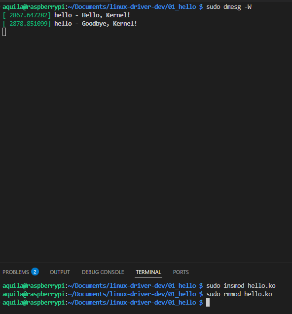
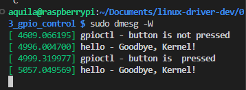
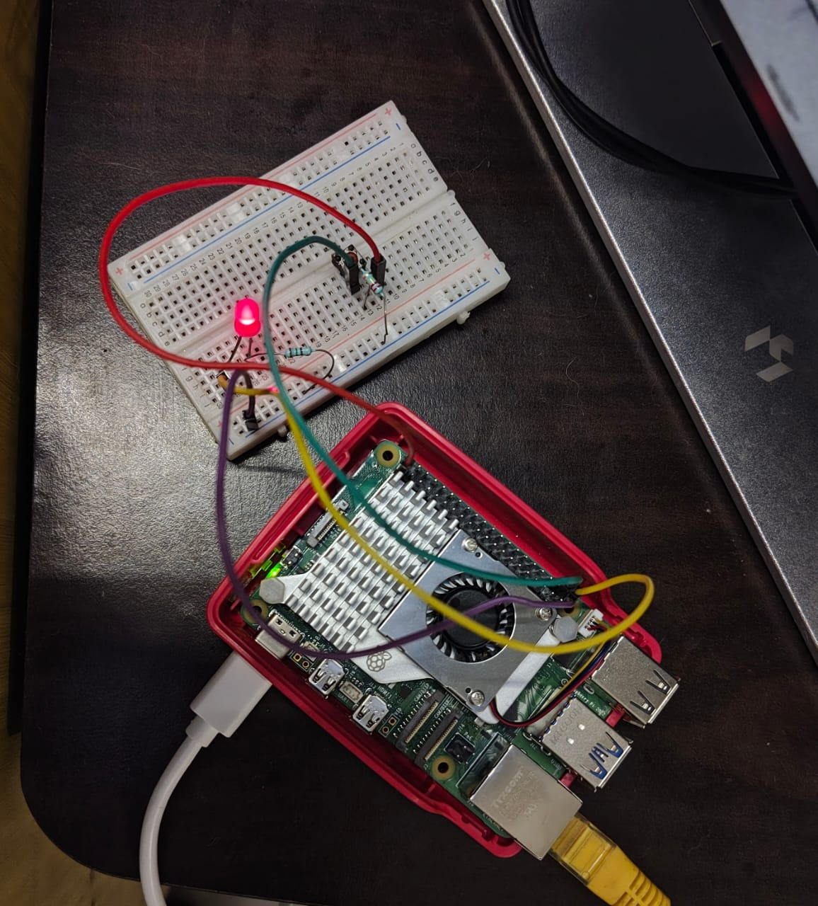
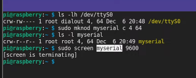

# The Linux Kernel

- Kernel: hardware abstraction layer (System call API)
- Task of kernel - process and resources management, scheduler, **hardware access through driver**
- monolithic kernel with **loadable** modules

# Kernel Modules




# Improved Kernel Module

- `__init` and `__exit`

```sh
aquila@raspberrypi:~/Documents/linux-driver-dev/02_better_hello $ modinfo hello.ko
filename:       /home/aquila/Documents/linux-driver-dev/02_better_hello/hello.ko
description:    A simple hello world Linux Kernel module
author:         aquila <aquila@mail.me>
license:        GPL
srcversion:     7A96C1FFCD5205411B62110
depends:        
name:           hello

aquila@raspberrypi:~/Documents/linux-driver-dev/02_better_hello $ lsmod | grep hello
hello                  49152  0
```

```
aquila@raspberrypi:~/Documents/linux-driver-dev/02_better_hello $ modinfo industrialio
filename:       /lib/modules/6.12.34+rpt-rpi-2712/kernel/drivers/iio/industrialio.ko.xz
license:        GPL
description:    Industrial I/O core
author:         Jonathan Cameron <jic23@kernel.org>
import_ns:      DMA_BUF
srcversion:     7E3195094E60FB9B5EB0AF4
depends:        
intree:         Y # intree
name:           industrialio
vermagic:       6.12.34+rpt-rpi-2712 SMP preempt mod_unload modversions aarch64
```

# Basic GPIO Control

```sh
aquila@raspberrypi:/sys/class/gpio $ cat gpiochip569/label
pinctrl-rp1
```
 




# Character and Block Devices


```sh
aquila@raspberrypi:~/Documents/linux-driver-dev/03_gpio_control $ ls -l /dev/mmcblk0 /dev/gpiochip0
crw-rw----+ 1 root gpio 254, 0 Sep  2 18:47 /dev/gpiochip0
brw-rw----  1 root disk 179, 0 Sep  2 18:47 /dev/mmcblk0
```

`major device no. , minor device no.`

`c` - character device file
`b` - block device file

>  The system call **mknod**() creates a filesystem node (file, device special file, or named pipe) named _pathname_, with attributes specified by _mode_ and _dev_.


